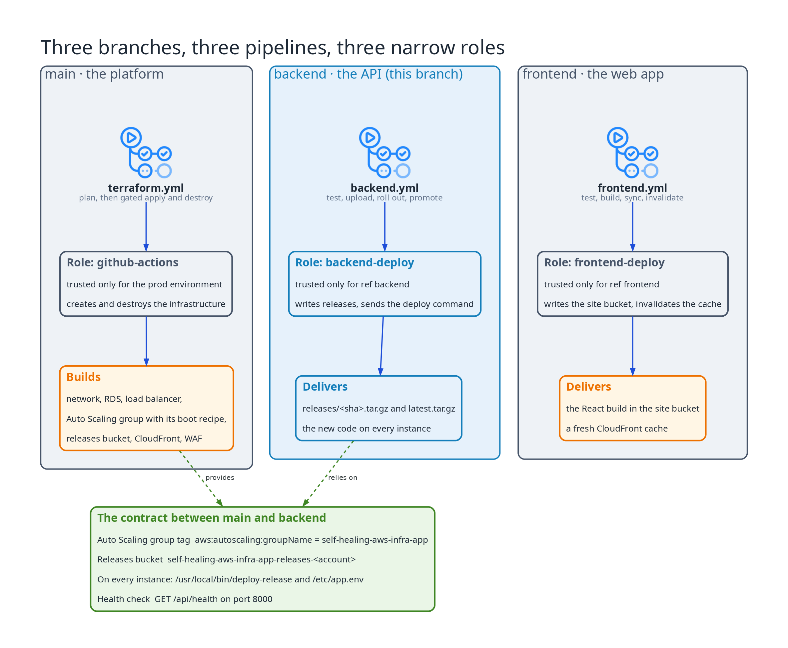
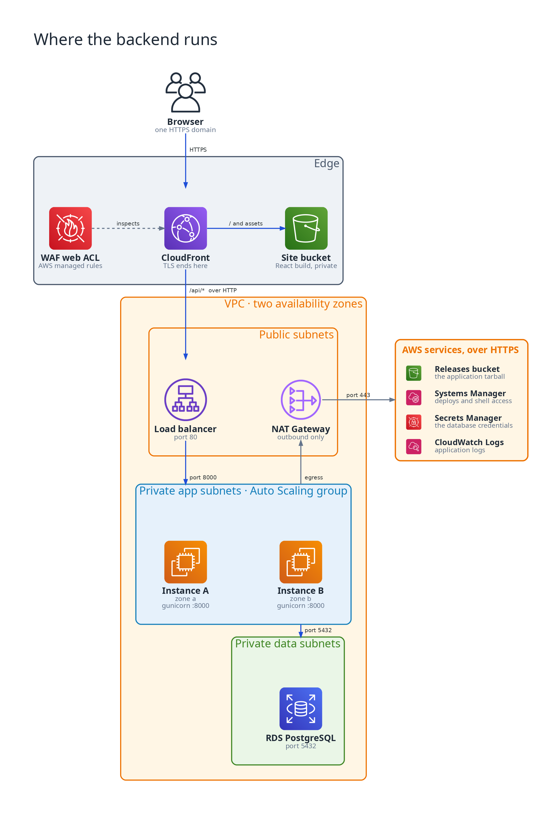
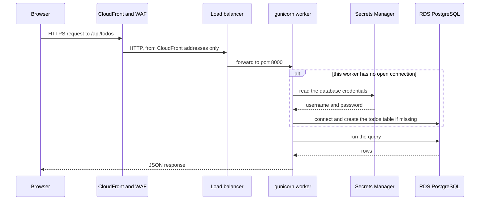
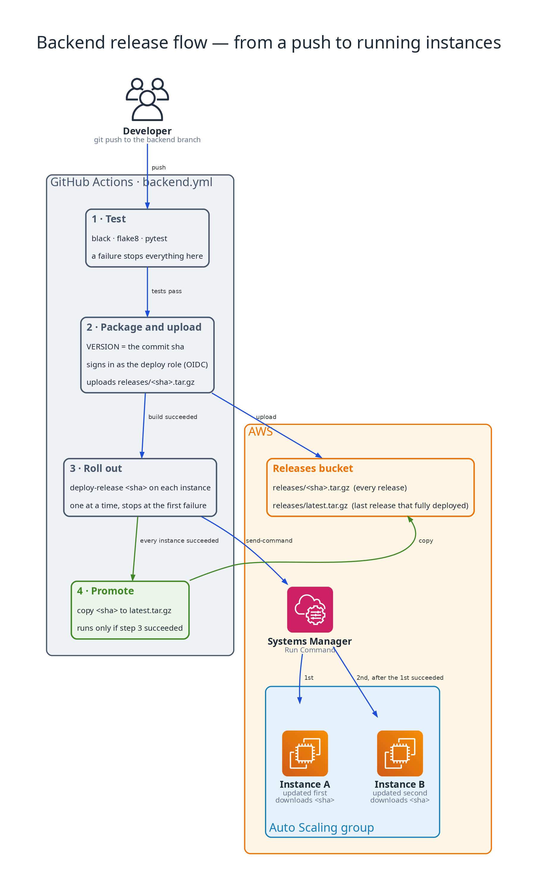
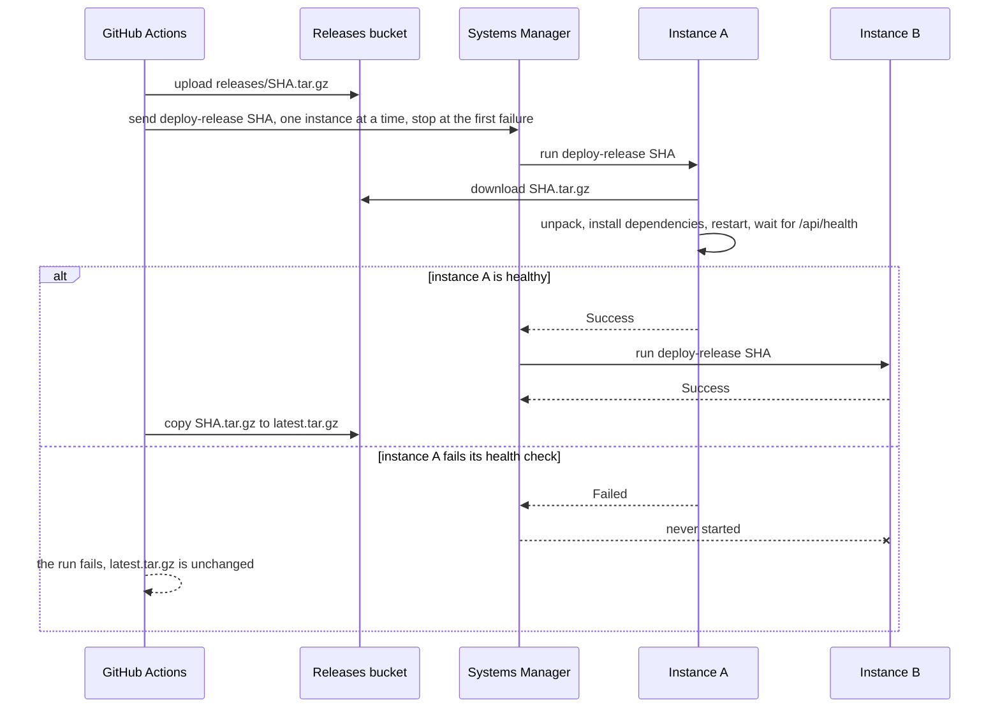
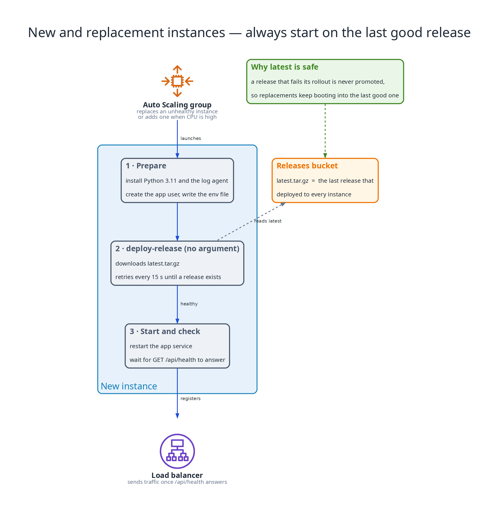

# Backend — the API tier and its delivery pipeline

This branch holds the to-do API that runs on the Auto Scaling group in [self-healing-aws-infra](https://github.com/mahmoudnasser1561/self-healing-aws-infra), together with the pipeline that tests it, ships it and rolls it out to the running instances. It contains no Terraform. The infrastructure the API runs on lives on `main`; this branch owns only the code that runs on it and the path that code takes to get there.

- [The role of this branch](#the-role-of-this-branch)
- [Architecture](#architecture)
- [The application](#the-application)
- [CI/CD](#cicd)
- [Architecture decisions](#architecture-decisions)
- [Operating it](#operating-it)
- [Behaviour worth knowing](#behaviour-worth-knowing)
- [Repository layout](#repository-layout)

## The role of this branch

The repository has three long-lived branches, and each one has its own pipeline and its own AWS role:



| Branch | Contains | Pipeline | AWS role, and who may assume it |
|---|---|---|---|
| `main` | Terraform for the whole environment | `terraform.yml`: plan, then a gated apply, then a gated destroy | `github-actions`, only for the `prod` environment |
| `backend` | This API | `backend.yml`: test, upload, roll out, promote | `backend-deploy`, only for workflows on `refs/heads/backend` |
| `frontend` | The React app | `frontend.yml`: test, build, sync, invalidate | `frontend-deploy`, only for workflows on `refs/heads/frontend` |

Terraform builds the platform, and this branch delivers the application onto it. The two meet at a small contract that neither side changes without the other:

| Contract | Value |
|---|---|
| How instances are found | The tag `aws:autoscaling:groupName = self-healing-aws-infra-app` |
| Where releases live | `self-healing-aws-infra-app-releases-<account-id>`, under `releases/` |
| What is on every instance | `/usr/local/bin/deploy-release` and `/etc/app.env`, installed by the launch template's user-data |
| How an instance proves it is ready | `GET /api/health` answering `200` on port 8000 |

The application is on its own branch for three reasons:

- **Different rates of change.** The API changes many times a day. The platform changes rarely and each change goes through a plan and a human approval. A code change should not have to wait for either, and should not be able to trigger an infrastructure change.
- **A small blast radius.** The role this pipeline signs in with can write to one bucket and send one kind of command to instances tagged with this project. It has no IAM, EC2 or database permissions, and it cannot read the Terraform state. Its trust policy accepts only workflow runs on this branch, so a pull request from a fork or a run on another branch cannot assume it.
- **Nothing local leaks in.** The branch has no shared history with `main`, so files that are ignored or private on `main` can never end up in a release.

## Architecture



CloudFront is the only public entry point. It serves the React app from a private bucket and forwards `/api/*` to the load balancer over HTTP, so the browser talks to one domain and the API needs no CORS configuration. A WAF web ACL inspects requests at the edge. The load balancer's security group accepts port 80 only from CloudFront's managed prefix list, so a request sent straight to it is refused.

The API runs on two instances, one per availability zone, in private subnets with no public address and no SSH. They reach the database on port 5432, which the database's security group allows from the app tier only. Everything else they need (the release tarball, remote commands, the database credentials, log delivery) goes out through the NAT Gateway to AWS services.

### How a request is served



## The application

A small Flask API: one shared to-do list, no authentication. It exists to give the platform a real database round trip to serve and monitor, and to have a release to deploy.

| Endpoint | Purpose |
|---|---|
| `GET /api/health` | A round trip to the database: returns the database clock, the number of todos and the release version, or `503` when the database is unreachable |
| `GET /api/todos` | All todos, newest first |
| `POST /api/todos` | Create a todo from `{"title": "..."}`; the title must be 1 to 200 characters, otherwise `400` |
| `DELETE /api/todos/<id>` | Delete a todo; returns `204` whether or not it existed |

The data is one table, created from `app/schema.sql` the first time a worker connects:

```sql
CREATE TABLE IF NOT EXISTS todos (
    id bigserial PRIMARY KEY,
    title text NOT NULL CHECK (char_length(title) BETWEEN 1 AND 200),
    created_at timestamptz NOT NULL DEFAULT now()
);
```

### Structure

`create_app` in `app/__init__.py` is an application factory. Configuration, the database and the routes are separate so each can be replaced in a test:

| Module | Responsibility |
|---|---|
| `app/config.py` | Reads the environment into one immutable `Config`, and the release version from the `VERSION` file (`dev` when there is none) |
| `app/db.py` | `Database`: one shared connection per worker, opened on first use |
| `app/todos.py` | The SQL for listing, adding and deleting todos and for the health query |
| `app/routes.py` | The `/api` blueprint: validation and responses |
| `wsgi.py` | The entry point gunicorn loads |
| `gunicorn.conf.py` | Port 8000, two workers, access and error logs under `/var/log/app` |

### Configuration

The instance's environment file, `/etc/app.env`, holds the only configuration and never a password:

| Variable | Meaning | Default |
|---|---|---|
| `DB_HOST` | The database endpoint | `localhost` |
| `DB_SECRET_ARN` | The Secrets Manager secret holding the database credentials | none |
| `AWS_REGION` | The region of that secret | `us-east-1` |
| `RELEASE_BUCKET` | The releases bucket, used by the deploy script | none |

`DB_PORT`, `DB_NAME`, `DB_SSLMODE` and `DB_USER` have defaults (`5432`, `app`, `require`, `postgres`). If `DB_PASSWORD` is set, the API uses it and never calls Secrets Manager, which is how it runs locally.

### The database connection

Each gunicorn worker opens one connection the first time it needs it, reading the credentials from Secrets Manager at that moment, and keeps using it with autocommit on. If the database restarts or fails over, the next request after the drop fails, and the one after it opens a fresh connection and reads the secret again. The application recovers with no intervention and holds no credentials in memory beyond the connection itself.

### Running it locally

```bash
python3.11 -m venv .venv && . .venv/bin/activate
pip install -r requirements-dev.txt

pytest -q          # 17 tests, no database and no network
black --check .
flake8

docker run -d --name todos-db -e POSTGRES_PASSWORD=postgres -e POSTGRES_DB=app -p 5432:5432 postgres:16
DB_HOST=localhost DB_USER=postgres DB_PASSWORD=postgres DB_SSLMODE=disable \
  gunicorn -c gunicorn.conf.py wsgi:app
curl localhost:8000/api/health
```

The tests cover the logic only: configuration parsing, the route table, request validation, the `503` from the health check when the database cannot be reached, and the conversion of a row to JSON. They use no database and no fakes.

## CI/CD



`.github/workflows/backend.yml` runs for pushes and pull requests to this branch:

| Job | Runs on | What it does |
|---|---|---|
| `test` | Every push and pull request | `black --check`, `flake8` and `pytest` on Python 3.11. A failure stops everything |
| `deploy-role-check` | Pushes | Signs in as the deploy role and prints its identity, proving the OIDC trust works |
| `deploy` | Pushes, after `test` passes, when the repository variable `BACKEND_DEPLOY_ENABLED` is `true` | Packages, uploads, rolls out and promotes, as below |

The environment is created for demonstrations and destroyed afterwards, so the variable is `false` whenever there is nothing to deploy to. The tests always run.

### The release

1. **Package.** The commit sha is written to `VERSION`, and `app/`, `wsgi.py`, `gunicorn.conf.py`, `requirements.txt` and `VERSION` are packed into one tarball. This is the artifact that is tested, stored and run: instances never build anything themselves, apart from installing its dependencies.
2. **Upload.** The tarball goes to the releases bucket as `releases/<sha>.tar.gz`. Every release is kept there under its commit sha.
3. **Roll out.** `scripts/rollout.sh` sends the command `deploy-release <sha>` through Systems Manager to every instance in the Auto Scaling group, selected by tag, with a concurrency of one and no tolerated errors. It polls until every instance has answered and fails the run unless all of them report `Success`.
4. **Promote.** Only after step 3 succeeded on every instance does the pipeline copy the tarball to `releases/latest.tar.gz`.

On an instance, `deploy-release` takes a lock, downloads the release it was given (or `latest.tar.gz` when it is given none), unpacks it into `/opt/app/src`, installs the dependencies into `/opt/app/venv`, restarts the `app` service, and waits up to a minute for `GET /api/health` to answer. It exits non-zero if the application never becomes healthy.



### Why a failed release cannot spread

- The rollout stops at the first instance that fails, so the remaining instances keep running the previous release and keep serving traffic.
- The instance that failed answers its health check unhealthy, so the load balancer stops sending it requests.
- `latest.tar.gz` moves only after every instance succeeded. A release that fails is therefore never what a new or replacement instance boots into.
- Recovery is a normal pipeline run: revert the commit, push, and the previous code is rolled out and promoted.

### New and replacement instances



The launch template's user-data prepares the instance and then runs the same `deploy-release` with no argument, retrying every 15 seconds until `latest.tar.gz` exists. A replacement for an unhealthy instance, or an instance added when CPU is high, therefore starts on the last release that fully deployed with no help from the pipeline. The CloudWatch agent starts once the release is running.

### The deploy role

The pipeline authenticates by exchanging its GitHub OIDC token for short-lived credentials. There are no AWS credentials stored in GitHub. The role `self-healing-aws-infra-backend-deploy` can:

- read and write the releases bucket, but not delete from it;
- send the `AWS-RunShellScript` command through Systems Manager, only to instances tagged as this project's;
- read the status of that command, and describe the group's instances and its load balancer targets, which is how a rollout is checked.

It has no IAM, EC2 or database permissions and no access to the Terraform state. Its trust policy accepts only tokens issued for `refs/heads/backend` of this repository.

## Architecture decisions

Six decisions shape this tier. They are summarised here as records: the decision, the reason and the consequences.

### ADR-0008: Rolling deploys through SSM Run Command

**Decision.** CI uploads each release to S3 and sends an SSM Run Command that runs `deploy-release <sha>` on the group's instances one at a time, stopping at the first failure. Only a fully deployed release becomes `latest.tar.gz`, which is what new instances boot from.
**Why.** Instances are in private subnets with no SSH, and a new release must reach them without downtime and without replacing them. SSM needs nothing beyond the agent already on the instance, and there is no deployment service to operate.
**Consequences.** A deploy takes seconds to a minute per instance and replaces nothing. A request routed to an instance during its short restart can fail. There is no automatic rollback: a failed rollout leaves the affected instance unhealthy until a good release is deployed.

### ADR-0002: No SSH, Session Manager only

**Decision.** Instances have no key pair, listen for no administrative logins, and no security group allows port 22. Shells and remote commands go through Systems Manager.
**Why.** There is then no inbound administrative path: no open port, no bastion and no key to rotate. Every session and command is tied to an IAM identity and recorded in CloudTrail.
**Consequences.** An instance that loses outbound HTTPS cannot be reached. The deploy pipeline depends on the same channel.

### ADR-0001: NAT Gateways provide private egress

**Decision.** Each availability zone has its own NAT Gateway, and each private app route table sends `0.0.0.0/0` to the gateway in its own zone. There are no VPC endpoints.
**Why.** The instances need Session Manager, package repositories, S3 and Secrets Manager. One mechanism covers all of them, including public repositories that no endpoint serves.
**Consequences.** Zones fail independently. The gateways are the largest fixed cost of the network tier, which is why the environment is built to be created and destroyed on demand. The app tier's security group allows outbound 443 to any address.

### ADR-0006: Data tier design

**Decision.** PostgreSQL 16 on RDS in private data subnets, Multi-AZ, reachable only from the app tier's security group. RDS generates and rotates the master password and stores it in Secrets Manager. The application reads the secret when it connects.
**Why.** A database credential never appears in the repository, in Terraform, in user-data or in a pipeline variable.
**Consequences.** A failover drops the application's open connection: the first request after it fails and the next reconnects, which is the behaviour described under [the database connection](#the-database-connection).

### ADR-0003: TLS through CloudFront's default certificate

**Decision.** Viewers connect to the distribution's `*.cloudfront.net` name over HTTPS with the certificate CloudFront provides, and HTTP is redirected to HTTPS. CloudFront reaches the load balancer over plain HTTP on port 80 inside AWS, and the load balancer accepts traffic only from CloudFront's origin-facing prefix list.
**Why.** Users must get HTTPS and the project owns no domain, so no custom certificate is available. CloudFront already sits in front of everything.
**Consequences.** There is end-to-end HTTPS from the browser to the edge with nothing to issue or renew. The hop from CloudFront to the load balancer is unencrypted but confined to CloudFront's own address ranges. The application is reached at a generated `*.cloudfront.net` address.

### ADR-0007: Frontend delivery through S3 and CloudFront

**Decision.** The React build is stored in a private S3 bucket that only CloudFront can read through origin access control. CloudFront serves the app from it and forwards `/api/*` to the load balancer with caching disabled, so both share one domain. The frontend pipeline builds, syncs the bucket and invalidates the cache.
**Why.** The web tier is static files and should be served fast from the edge, kept off the compute tier, and share an origin with the API so the browser needs no cross-origin configuration.
**Consequences.** The API needs no CORS headers, and the load balancer is reachable only through CloudFront. The web tier has no servers to run, and its bucket has no public access of any kind. Every frontend deploy must invalidate the cache or users keep the previous build.

## Operating it

Open a shell on an instance, with no SSH involved:

```bash
aws ssm start-session --target <instance-id>
```

Read the application's logs:

- In CloudWatch Logs, the group `/self-healing-aws-infra/app` has one stream per instance and file (`access.log`, `error.log`).
- On the instance they are in `/var/log/app`, and `journalctl -u app` shows the service.

See which release is live, through the public address:

```bash
curl https://<cloudfront-domain>/api/health
# {"db_time": "...", "status": "ok", "todos": 0, "version": "<commit sha>"}
```

List the releases, and see which one `latest` is:

```bash
aws s3 ls s3://self-healing-aws-infra-app-releases-<account-id>/releases/
```

Roll back by reverting the bad commit on this branch and pushing. The pipeline tests it, rolls it out and promotes it like any other release.

## Behaviour worth knowing

Measured against the deployed environment:

| Scenario | Result |
|---|---|
| Rolling redeploy under continuous requests | 128 of 128 requests succeeded while both instances were redeployed one after the other |
| A release that starts but never answers its health check | The rollout failed on the first instance, the second instance was never touched, `latest.tar.gz` stayed on the previous release, and the site kept answering from the healthy instance |
| Terminating the instance that held the bad release | The Auto Scaling group launched a replacement that was healthy in about 77 seconds, on the last good release and not the bad one |
| Deploying a good release afterwards | The fleet recovered and `latest.tar.gz` moved to it |

Limits by design:

- A request routed to an instance during its brief restart can fail. The rollout is one instance at a time, so the other keeps serving.
- There is no automatic rollback. A failed rollout leaves the affected instance unhealthy, and the load balancer keeps traffic away from it until a good release is deployed.
- The API has one shared list and no authentication, and each worker holds a single database connection.

## Repository layout

```
app/                   the Flask application: config, db, todos, routes, schema.sql
wsgi.py                gunicorn entry point
gunicorn.conf.py       port, workers and log locations
requirements.txt       runtime dependencies
requirements-dev.txt   test and lint tools
tests/                 logic-only tests: config, routes, SQL helpers
scripts/rollout.sh     the SSM rollout used by the pipeline
.github/workflows/     backend.yml
docs/diagrams/         the diagrams in this document
```
