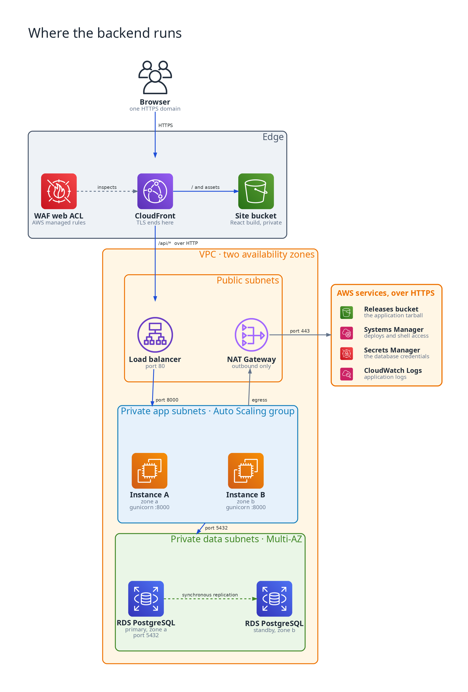
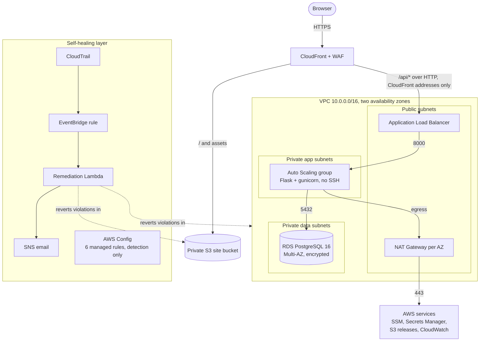
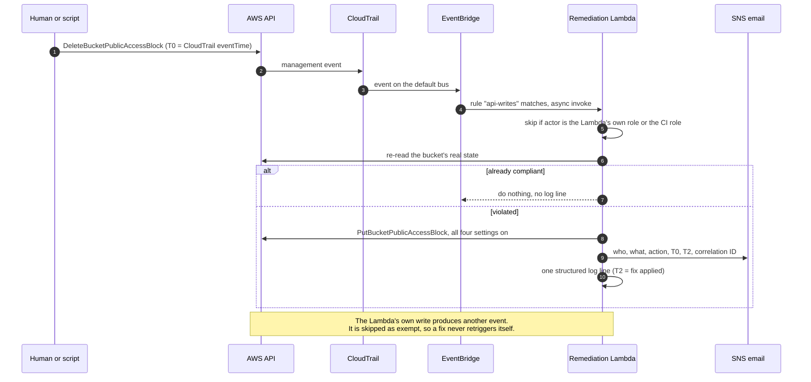
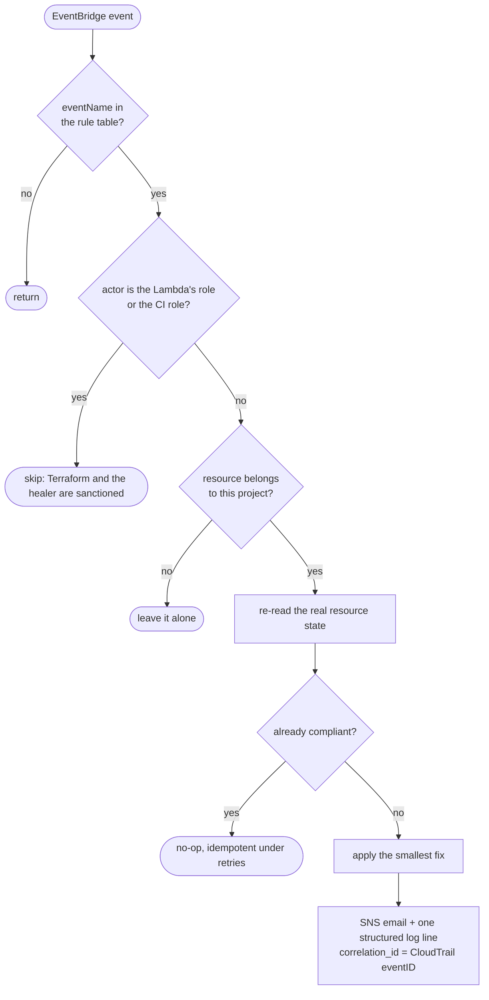
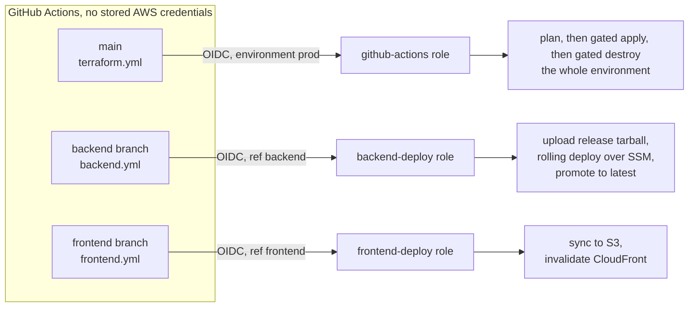

# Self-Healing AWS Infra

A three-tier AWS environment (React, Flask, PostgreSQL) built entirely in Terraform and deployed through GitHub Actions with OIDC, with a self-healing layer that detects and reverts its own security misconfigurations within seconds. No SSH, no long-lived credentials, and no manual step when a bucket or a security group is opened up by mistake.

- [What it does](#what-it-does)
- [Measured results](#measured-results)
- [Architecture](#architecture)
- [The self-healing loop](#the-self-healing-loop)
- [Delivery pipelines](#delivery-pipelines)
- [Replicate it](#replicate-it)
- [Try to break it](#try-to-break-it)
- [Tests](#tests)
- [Repository layout](#repository-layout)
- [Cost](#cost)
- [Known limits](#known-limits)
- [Documentation](#documentation)

## What it does

- **Serves an app.** CloudFront (with a WAF web ACL) serves a React SPA from a private S3 bucket and forwards `/api/*` to an Application Load Balancer, which fronts a Flask API on an Auto Scaling group in private subnets, backed by a private RDS PostgreSQL database. CloudFront is the only public entry point.
- **Deploys without secrets.** Terraform runs in GitHub Actions and assumes an AWS role through OIDC. `apply` and `destroy` each wait for a human approval. The API and the SPA ship from their own branches through their own, much narrower, roles.
- **Heals itself.** CloudTrail records every write API call, EventBridge matches the ones that can create a violation, and one Lambda re-reads the real resource state, reverts the violation, verifies the fix and sends an email saying who did what and what the system did about it.

## Measured results

Measured against the live environment on 2026-09-28 (us-east-1) with the chaos scripts in [`chaos/`](chaos/). Method, raw numbers and arithmetic are in [docs/mttr.md](docs/mttr.md) and [docs/cost.md](docs/cost.md).

| Claim | Result | Sample |
|---|---|---|
| Time to remediate a public S3 bucket (CloudTrail event time to completed fix, confirmed compliant by the chaos script) | p50 **8.1 s**, p95 **11.6 s**, max 11.6 s | 10 runs |
| Cost per incident (Lambda billed duration plus one SNS publish) | about **$0.0000025** | 41 invocations, 17 incidents |
| Duplicate remediations | **0** | 17 runs, one log line per CloudTrail event ID |
| Violation classes remediated and verified against a real triggered violation | **4 classes, 3 services** (S3, EC2, CloudTrail) | S3-1 ×10, SG-1 ×5, EC2-1 ×1, CT-1 ×1 |
| Email alert delivered end to end | yes | 1 run |

Single-run classes are reported as verified, not as percentiles. The RDS rule is implemented but not verified; see [Known limits](#known-limits). The runs were made on the environment as deployed that day, with one NAT Gateway and a single-AZ database; the detection and remediation path does not depend on either setting.

## Architecture




```mermaid
flowchart TB
    user([Browser]) -->|HTTPS| cf[CloudFront + WAF]
    cf -->|"/ and assets"| s3[(Private S3 site bucket)]
    cf -->|"/api/* over HTTP, CloudFront addresses only"| alb[Application Load Balancer]

    subgraph vpc["VPC 10.0.0.0/16, two availability zones"]
        subgraph pub["Public subnets"]
            alb
            nat[NAT Gateway per AZ]
        end
        subgraph app["Private app subnets"]
            asg["Auto Scaling group<br/>Flask + gunicorn, no SSH"]
        end
        subgraph data["Private data subnets"]
            rds[("RDS PostgreSQL 16<br/>Multi-AZ, encrypted")]
        end
        alb -->|8000| asg
        asg -->|5432| rds
        asg -->|egress| nat
    end

    nat -->|443| aws["AWS services<br/>SSM, Secrets Manager,<br/>S3 releases, CloudWatch"]

    subgraph heal["Self-healing layer"]
        ct[CloudTrail] --> eb[EventBridge rule]
        eb --> fn[Remediation Lambda]
        fn --> sns[SNS email]
        cfg["AWS Config<br/>6 managed rules, detection only"]
    end

    fn -.->|reverts violations in| s3
    fn -.->|reverts violations in| vpc
```

| Tier | Component | Reachable from |
|---|---|---|
| Edge | CloudFront, WAF web ACL (AWS managed common and known-bad-inputs rule groups), private site bucket | The internet |
| API | ALB in public subnets, Flask on an Auto Scaling group (2 to 3 `t3.micro`, IMDSv2 required, no key pair) in private subnets | CloudFront's address range only |
| Data | RDS PostgreSQL 16, encrypted, not publicly accessible, credentials generated and held by RDS in Secrets Manager | The app tier's security group on 5432 only |

Every module, security-group rule and IAM scope is described in [docs/infra.md](docs/infra.md).

## The self-healing loop


```mermaid
sequenceDiagram
    autonumber
    participant Caller as Human or script
    participant AWS as AWS API
    participant CT as CloudTrail
    participant EB as EventBridge
    participant L as Remediation Lambda
    participant SNS as SNS email

    Caller->>AWS: DeleteBucketPublicAccessBlock (T0 = CloudTrail eventTime)
    AWS->>CT: management event
    CT->>EB: event on the default bus
    EB->>L: rule "api-writes" matches, async invoke
    L->>L: skip if actor is the Lambda's own role or the CI role
    L->>AWS: re-read the bucket's real state
    alt already compliant
        L-->>EB: do nothing, no log line
    else violated
        L->>AWS: PutBucketPublicAccessBlock, all four settings on
        L->>SNS: who, what, action, T0, T2, correlation ID
        L->>L: one structured log line (T2 = fix applied)
    end
    Note over AWS,L: The Lambda's own write produces another event.<br/>It is skipped as exempt, so a fix never retriggers itself.
```

One EventBridge rule matches write calls from S3, EC2, RDS and CloudTrail. One Python Lambda (`lambdas/remediate`, under 200 lines across two files) dispatches on the API call name:

| Rule | Violation (triggering call) | Remediation | Scope |
|---|---|---|---|
| S3-1 | Block Public Access removed or weakened (`DeleteBucketPublicAccessBlock`, `PutBucketPublicAccessBlock`) | Turn all four settings back on | Buckets named `self-healing-aws-infra-*` |
| SG-1 | World-open ingress (`AuthorizeSecurityGroupIngress`, `0.0.0.0/0` or `::/0`) | Revoke exactly the open rules, by rule ID | Groups tagged `Project=self-healing-aws-infra` |
| RDS-1 | Database made public (`ModifyDBInstance`) | Set `PubliclyAccessible` back to false | Databases named `self-healing-aws-infra-*` |
| EC2-1 | IMDSv2 downgraded (`ModifyInstanceMetadataOptions`) | Require session tokens again | Instances tagged with the project |
| CT-1 | Trail logging stopped (`StopLogging`) | Start logging again | Trails named `self-healing-aws-infra*` |

How the handler decides, and why every path ends in one outcome:


```mermaid
flowchart TD
    start([EventBridge event]) --> known{"eventName in<br/>the rule table?"}
    known -- no --> ignore([return])
    known -- yes --> exempt{"actor is the Lambda's role<br/>or the CI role?"}
    exempt -- yes --> skip([skip: Terraform and the healer are sanctioned])
    exempt -- no --> scope{"resource belongs<br/>to this project?"}
    scope -- no --> leave([leave it alone])
    scope -- yes --> read["re-read the real resource state"]
    read --> ok{already compliant?}
    ok -- yes --> noop([no-op, idempotent under retries])
    ok -- no --> fix["apply the smallest fix"]
    fix --> out["SNS email + one structured log line<br/>correlation_id = CloudTrail eventID"]
```

AWS Config runs alongside as an independent detector (six managed rules covering the same violations plus CloudTrail being enabled). It is detection only and is not connected to the Lambda. Design rationale: [ADR-0004](docs/adr/0004-event-driven-remediation.md) and [ADR-0005](docs/adr/0005-plain-dispatch-table.md).

## Delivery pipelines


```mermaid
flowchart LR
    subgraph gh["GitHub Actions, no stored AWS credentials"]
        m["main<br/>terraform.yml"]
        b["backend branch<br/>backend.yml"]
        f["frontend branch<br/>frontend.yml"]
    end

    m -->|"OIDC, environment prod"| r1["github-actions role"]
    b -->|"OIDC, ref backend"| r2["backend-deploy role"]
    f -->|"OIDC, ref frontend"| r3["frontend-deploy role"]

    r1 --> tf["plan, then gated apply, then gated destroy<br/>the whole environment"]
    r2 --> rel["upload release tarball,<br/>rolling deploy over SSM,<br/>promote to latest"]
    r3 --> web["sync to S3,<br/>invalidate CloudFront"]
```

| Pipeline | Runs on | Does | Assumes |
|---|---|---|---|
| `terraform.yml` | `main` changes under `envs/` or `modules/`, or manual dispatch | plan, then an approved apply, then an approved destroy | `github-actions`, only for `main` and the `prod` environment |
| `backend.yml` (branch `backend`) | pushes and pull requests | black, flake8, pytest, then upload, a one-instance-at-a-time rollout, promote | `backend-deploy`, only for the `backend` branch |
| `frontend.yml` (branch `frontend`) | pushes and pull requests | ESLint, type check, tests, build, then sync and invalidate | `frontend-deploy`, only for the `frontend` branch |

During a live rolling redeploy, 128 of 128 requests succeeded, and a terminated instance was replaced and healthy in about 77 seconds.

## Replicate it

You need an AWS account with administrator credentials on your workstation, a GitHub account, and these tools: Terraform 1.10 or later, the AWS CLI v2, the GitHub CLI (`gh`), Python 3.12 and `git`. The full walkthrough with checks after each step is in [docs/replicate.md](docs/replicate.md); this is the short version.

```bash
# 1. Fork the repository and clone your fork (then open the fork's Actions tab and enable workflows)
gh repo fork mahmoudnasser1561/self-healing-aws-infra --clone && cd self-healing-aws-infra

# 2. Point the bootstrap at your fork and your account
OWNER=$(gh api user --jq .login)
REPO=self-healing-aws-infra
OWNER_ID=$(gh api user --jq .id)
REPO_ID=$(gh api repos/$OWNER/$REPO --jq .id)
ACCOUNT=$(aws sts get-caller-identity --query Account --output text)

cat > bootstrap/terraform.tfvars <<EOF
github_owner    = "$OWNER"
github_owner_id = "$OWNER_ID"
github_repo_id  = "$REPO_ID"
EOF
sed -i "s/self-healing-aws-infra-tfstate-[0-9]*/self-healing-aws-infra-tfstate-$ACCOUNT/" envs/dev/providers.tf

# 3. One-time bootstrap from your workstation: state bucket, OIDC provider, CI roles
make bootstrap

# 4. Give GitHub the role ARNs, your alert address and an approval gate
gh variable set AWS_ROLE_ARN                 --body "$(cd bootstrap && terraform output -raw github_actions_role_arn)"
gh variable set AWS_BACKEND_DEPLOY_ROLE_ARN  --body "$(cd bootstrap && terraform output -raw backend_deploy_role_arn)"
gh variable set AWS_FRONTEND_DEPLOY_ROLE_ARN --body "$(cd bootstrap && terraform output -raw frontend_deploy_role_arn)"
gh variable set ALERT_EMAIL                  --body "you@example.com"
gh variable set BACKEND_DEPLOY_ENABLED       --body true
gh variable set FRONTEND_DEPLOY_ENABLED      --body true
echo "{\"reviewers\":[{\"type\":\"User\",\"id\":$OWNER_ID}]}" | \
  gh api --method PUT repos/$OWNER/$REPO/environments/prod --input -

# 5. Commit the two edited files to your fork's main, then start the pipeline
git add envs/dev/providers.tf && git commit -m "Point the state backend at my account" && git push
gh workflow run terraform.yml        # then approve "apply" in the Actions tab (about 7 minutes)
```

Then confirm the SNS subscription from the email AWS sends to your address (check spam; click **Confirm subscription**, not Unsubscribe), and ship the application:

```bash
# Deploy the API and the SPA: push a commit to each branch so its pipeline runs
for b in backend frontend; do git checkout $b && git commit --allow-empty -m "Deploy" && git push origin $b; done
git checkout main

# Open the site
aws cloudfront list-distributions \
  --query "DistributionList.Items[?Comment=='self-healing-aws-infra'].DomainName | [0]" --output text
```

Tear it all down when you are finished: run `gh workflow run terraform.yml` again, approve `apply` (a no-op on a converged environment), then approve `destroy` when it appears. `bootstrap/` stays in place; remove it separately with `terraform destroy` if you want the account clean.

## Try to break it

Each script violates one rule on purpose, prints a timestamp, then polls until the resource is compliant again and records the elapsed time in `chaos/results.log`. They use your own credentials, so run them as a user that is not the CI role.

```bash
make chaos-s3     # S3-1: remove Block Public Access from the site bucket
make chaos-sg     # SG-1: open port 22 to 0.0.0.0/0 on the app security group
make chaos-ec2    # EC2-1: downgrade an instance off IMDSv2
make chaos-ct     # CT-1: stop the CloudTrail trail
make chaos-rds    # RDS-1: make the database publicly accessible (see Known limits)

# Watch what the healer did, and check for your alert email
aws logs tail /aws/lambda/self-healing-aws-infra-remediate --since 10m
cat chaos/results.log
```

A healthy run prints `outcome=remediated` with the elapsed seconds, and the Lambda log shows exactly one JSON line per violation:

```
{"rule": "fix_public_access_block", "event": "DeleteBucketPublicAccessBlock", "action": "turned all four public access block settings on for self-healing-aws-infra-frontend-<account>", "t0": "...", "t2": "...", "correlation_id": "<CloudTrail eventID>"}
```

Repeat a script ten times and read `seconds=` from `chaos/results.log` to reproduce the percentile.

## Tests

```bash
cd lambdas
python3 -m venv .venv && . .venv/bin/activate
pip install -r requirements-dev.txt
pytest          # 22 tests: moto for S3, EC2, RDS, CloudTrail and SNS
black --check . && flake8
```

`test_real_events.py` checks the handler's field paths against CloudTrail events captured from a live run when a local `input.json` is present, and is skipped otherwise. The API and SPA have their own test suites on their branches.

## Repository layout

| Path | Contents |
|---|---|
| `bootstrap/` | State bucket, GitHub OIDC provider, CI roles and their policies. Applied once, locally. |
| `envs/dev/` | The deployable environment: providers, S3 backend and the module calls that wire everything together |
| `modules/networking`, `security`, `data`, `backend`, `frontend` | The three-tier stack, one module per component |
| `modules/detection` | What is watched: CloudTrail trail, the EventBridge rule, AWS Config recorder and rules |
| `modules/remediation` | The Lambda, its least-privilege role, the SNS topic and the rule-to-Lambda hookup |
| `lambdas/remediate` | `handler.py` (the pipeline) and `rules.py` (one function per rule, plus the dispatch table) |
| `lambdas/tests` | Unit tests |
| `chaos/` | One script per rule, plus the shared timing driver |
| `.github/workflows/` | `terraform.yml` and an OIDC smoke test |
| `docs/` | Architecture, infra reference, results, cost, replication walkthrough and ADRs |

The API lives on the `backend` branch and the SPA on the `frontend` branch, each with its own pipeline and no shared history with `main`.

## Cost

The environment is built to be created and destroyed on demand. While it is up it costs roughly $0.20 per hour (an estimate from list prices, dominated by the NAT Gateways, the load balancer and the database); a remediation costs a fraction of a thousandth of a cent. Breakdown and arithmetic: [docs/cost.md](docs/cost.md).

## Known limits

- **RDS-1 is implemented but not verified.** RDS applies `ModifyDBInstance` asynchronously, so the CloudTrail event can arrive while the instance still reports `PubliclyAccessible=false`. The Lambda then correctly does nothing, and the instance becomes public a few seconds later with no further event to react to. Details in [docs/mttr.md](docs/mttr.md#known-limit-rds-1).
- **Config is detection only.** It flags violations but does not trigger remediation. Its evaluation also lagged the event path by a wide margin (about a minute for S3, EC2 and security groups, and longer than three minutes for RDS and CloudTrail in the runs observed).
- **Scope is deliberate.** Remediation acts only on resources named or tagged for this project, and it never fights the Terraform pipeline.
- **One account, one region, one dev environment.** Measurements come from a single AWS account with the runs triggered from a CLI user.

## Documentation

| Document | What it covers |
|---|---|
| [docs/architecture.md](docs/architecture.md) | How the pieces fit and why |
| [docs/infra.md](docs/infra.md) | Module-by-module Terraform reference, security groups, IAM |
| [docs/replicate.md](docs/replicate.md) | Step-by-step reproduction with checks and troubleshooting |
| [docs/mttr.md](docs/mttr.md) | Measured results, method and raw data |
| [docs/cost.md](docs/cost.md) | Per-incident and standing cost |
| [docs/adr/](docs/adr/) | Architecture decisions |
