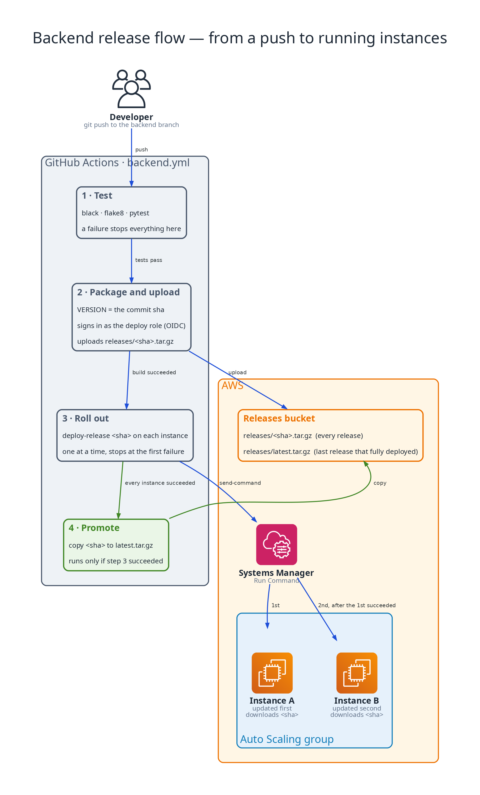
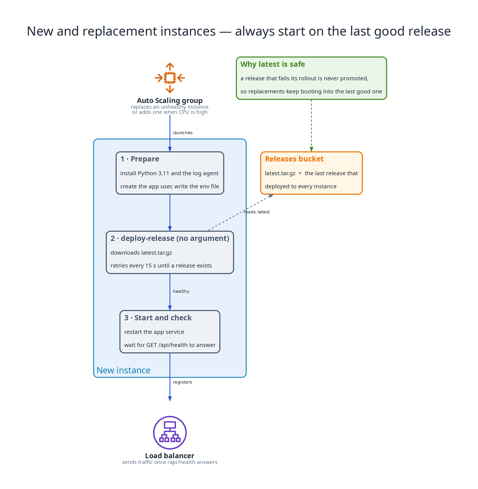

# ADR-0008: Rolling deploys through SSM Run Command

Status: Accepted

## Context

The API runs from a release tarball that CI tests and packages once. The instances sit in private subnets with no SSH, and two of them run behind a load balancer. A new release has to reach the running instances without downtime and without replacing them. Instances that start later, through scale-out or the replacement of an unhealthy one, must come up on the current release with no help from CI.

## Decision

CI uploads each release to the releases bucket as `releases/<sha>.tar.gz`. It then sends an SSM Run Command to the Auto Scaling group's instances, selected by the `aws:autoscaling:groupName` tag, that runs `/usr/local/bin/deploy-release <sha>`. The command runs on one instance at a time (`MaxConcurrency 1`) and stops after the first failure (`MaxErrors 0`). The pipeline waits for the result and fails the run if any instance did not succeed. Only when every instance has deployed the release does CI copy it to `releases/latest.tar.gz`.

The script on the instance downloads the release it was given (or `latest.tar.gz` when it is given none), unpacks it into `/opt/app/src`, installs the dependencies into `/opt/app/venv`, restarts the `app` service, and waits up to a minute for `GET /api/health` to answer. It exits non-zero if it never does. The same script runs from user-data at boot with no argument, retrying until the first release exists, so every new instance starts on the last release that deployed successfully.

The pipeline signs in with its own role, which can write to the releases bucket and send commands through SSM to instances tagged with this project. It has no IAM, EC2 or database permissions, and it cannot read the Terraform state.

## Consequences

- A deploy takes seconds to a minute per instance and replaces no instances.
- While one instance restarts the other keeps serving. A request routed to the restarting instance during its short restart can fail.
- A failed deploy stops the rollout and leaves the remaining instances untouched. The affected instance answers unhealthy, so the load balancer stops sending it traffic, and deploying a good release restores it. There is no automatic rollback.
- The same tested tarball is what every instance runs, and each release stays in the versioned bucket under its commit sha.
- `latest.tar.gz` only ever points at a release that deployed to every instance, so a failed release never becomes what a new or replacement instance boots into.
- Deploying needs working SSM connectivity on the instances, which the NAT Gateway provides.
