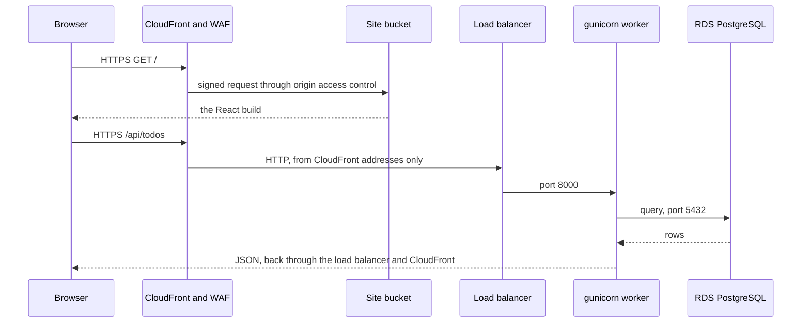
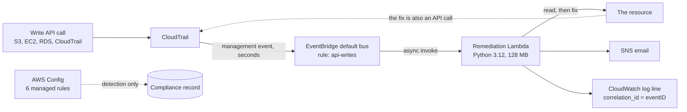

# Architecture

## The shape of the system

Three tiers, each one network hop more private than the last, and a self-healing layer that watches the whole account.

1. **Frontend.** A React SPA, built and pushed to a private S3 bucket and served through CloudFront with a WAF web ACL. CloudFront is the only component reachable from the open internet.
2. **Backend API.** A Flask app on an Auto Scaling group in private subnets, reachable only from the load balancer, which accepts traffic only from CloudFront's address range.
3. **Data.** A single RDS PostgreSQL instance in its own private subnets, reachable only from the backend's security group. Its credentials are generated and held by RDS in Secrets Manager and never appear in Terraform, user-data or application configuration.
4. **Self-healing.** CloudTrail, an EventBridge rule and one Lambda that revert violations of the rules below, plus AWS Config as an independent detector.

Module boundaries, security-group rules and IAM scoping are in [infra.md](infra.md). The deployed diagram is in the [README](../README.md#architecture).

## How a request is served

The browser talks to one domain for both the app and the API, so the API needs no CORS configuration. TLS ends at CloudFront ([ADR-0003](adr/0003-tls-via-cloudfront.md)). There is no SSH anywhere; operators use Session Manager ([ADR-0002](adr/0002-no-ssh.md)).

## The self-healing loop

Every change to the account is an API call, and every write call is recorded by CloudTrail. That makes the API stream the source of truth for what just changed, and the loop reacts to it directly.

**Detection.** One EventBridge rule matches write calls (`readOnly = false`) whose `source` is `aws.s3`, `aws.ec2`, `aws.rds` or `aws.cloudtrail`. The Lambda then picks out the calls that can create a violation ([ADR-0004](adr/0004-event-driven-remediation.md)).

**Decision.** For each call the Lambda does the same things in order:

1. Look the call up in the rule table. An unknown call is ignored.
2. Skip the event if its actor is the Lambda's own role or the Terraform pipeline's role. Terraform is the sanctioned way to change the environment, and the healer's own writes must not retrigger it.
3. Confirm the resource belongs to this project by name prefix or `Project` tag.
4. Re-read the resource's real state, and do nothing if it is already compliant.
5. Apply the smallest fix, publish one SNS message, and write one JSON log line.

Steps 2 and 4 together are the loop protection. The Lambda's own fix is an API write that comes straight back through the same rule; it is skipped as exempt in a few milliseconds. And because delivery is asynchronous and at-least-once, re-reading state before acting makes a repeated delivery harmless.

**The rules.**

| Rule | Violation | Fix |
|---|---|---|
| S3-1 | Block Public Access removed or weakened on a project bucket | Turn all four settings back on |
| SG-1 | A rule allowing `0.0.0.0/0` or `::/0` inbound on a project security group | Revoke exactly those rules by rule ID |
| RDS-1 | A project database made publicly accessible | Set `PubliclyAccessible` back to false (see the limit below) |
| EC2-1 | A project instance's metadata service moved off IMDSv2 | Require session tokens again |
| CT-1 | The project trail's logging stopped | Start logging again |

The Lambda's IAM role lists each action it needs and scopes it to project resources where the API allows it, so a bug in a rule cannot reach beyond the project. The code is two files and the reasoning is in [ADR-0005](adr/0005-plain-dispatch-table.md).

**Notification.** The SNS email carries the rule, the API call, the actor, the action taken, T0 (the CloudTrail event time), T2 (when the fix returned) and a correlation ID. The same ID is in the log line, so one incident can be traced from the email to the log to the CloudTrail event.

**Config.** Six AWS-managed rules evaluate the same violations and CloudTrail being enabled. They give an independent compliance view but are not wired to the Lambda, because the event path was measurably faster and its events are shaped differently.

### What the loop cannot do

- It reacts to API calls. A misconfiguration that never passes through one of the listed calls is recorded by Config but not fixed.
- A service that applies a change asynchronously can be reported by CloudTrail before the change is visible. RDS does this, so the RDS-1 rule does not close the loop against a live instance ([mttr.md](mttr.md#known-limit-rds-1)).

## Security model

| Control | How |
|---|---|
| No stored credentials | GitHub OIDC exchanged for short-lived AWS credentials; trust policies pinned to GitHub's numeric owner and repository IDs |
| Least-privilege pipelines | Three roles: the environment builder (only `main` and the `prod` environment), the API deployer (only the `backend` branch) and the SPA deployer (only the `frontend` branch), each with only what its pipeline needs |
| Human gate | `apply` and `destroy` wait for approval on the `prod` environment |
| No administrative inbound path | No key pairs, no port 22 anywhere, Session Manager only |
| Private data tier | No route out, not publicly accessible, reachable on 5432 from the app tier only |
| Hardened compute | IMDSv2 required, encrypted volumes, no public addresses on instances |
| Edge protection | WAF managed rule groups; load balancer reachable only from CloudFront's prefix list |
| Guardrails that heal | The five rules above, so the controls above are restored if someone weakens them |

## Delivery

Three branches, three pipelines, three roles ([README](../README.md#delivery-pipelines)). Terraform builds the platform from `main`; the API and the SPA are delivered onto it from their own branches through a small contract: the Auto Scaling group's name tag, the releases bucket and `GET /api/health`. The API rolls out to one instance at a time and promotes the release to `latest` only after every instance succeeded ([ADR-0008](adr/0008-ssm-rolling-deploy-not-codedeploy.md)). A live rolling redeploy served 128 of 128 requests, and a terminated instance was replaced and healthy in about 77 seconds.

## Design decisions

Full index in [adr/](adr/):

- One NAT Gateway per availability zone for private egress: [ADR-0001](adr/0001-nat-gateway-egress.md)
- No SSH, Session Manager only: [ADR-0002](adr/0002-no-ssh.md)
- TLS from CloudFront's default certificate, no domain needed: [ADR-0003](adr/0003-tls-via-cloudfront.md)
- Remediation driven by API events, Config as a detector: [ADR-0004](adr/0004-event-driven-remediation.md)
- One handler and a dispatch table: [ADR-0005](adr/0005-plain-dispatch-table.md)
- Data tier design: [ADR-0006](adr/0006-data-tier-design.md)
- Frontend delivery through S3 and CloudFront: [ADR-0007](adr/0007-frontend-delivery.md)
- Rolling deploys through Systems Manager, not CodeDeploy: [ADR-0008](adr/0008-ssm-rolling-deploy-not-codedeploy.md)
